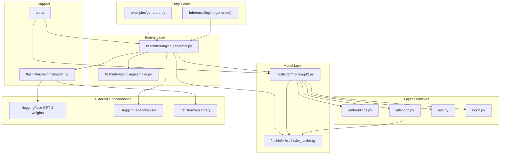
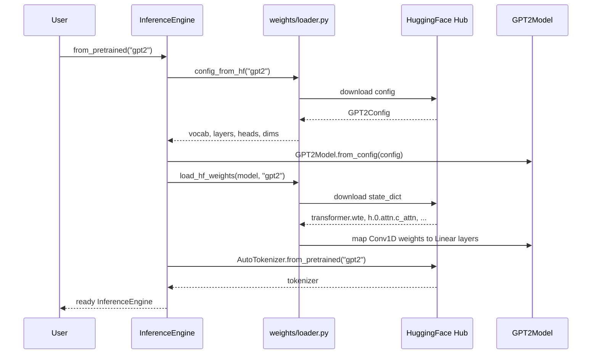
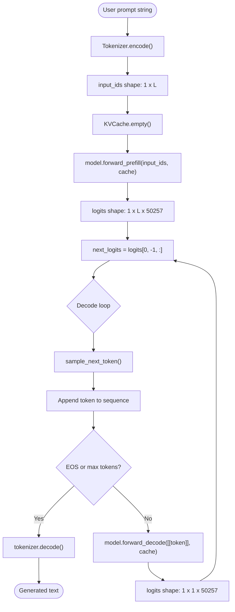
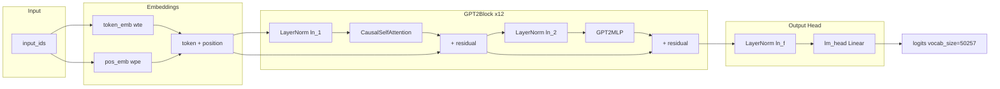
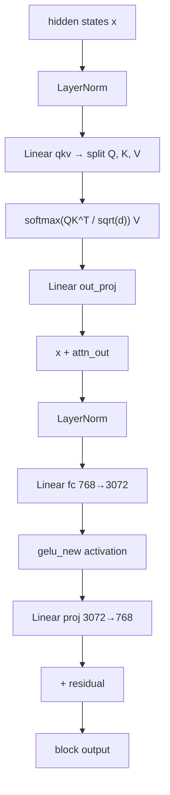
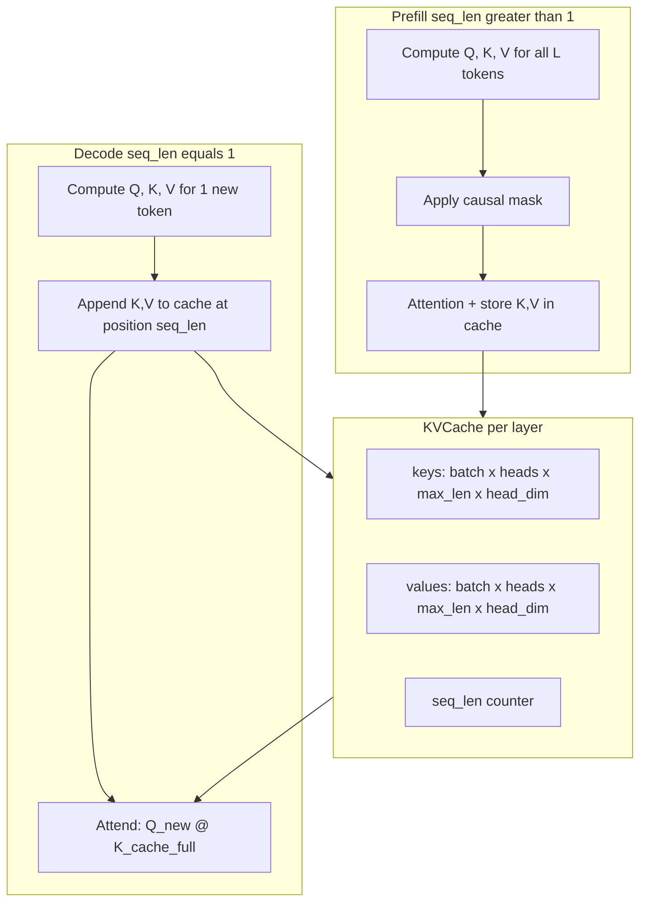
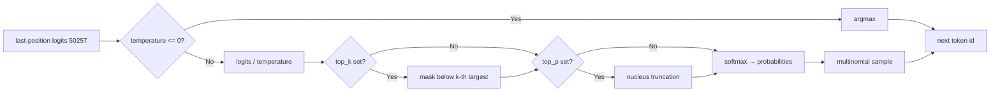
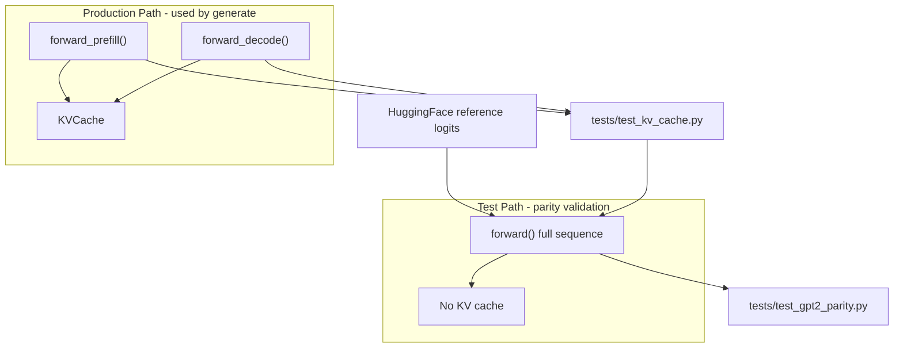
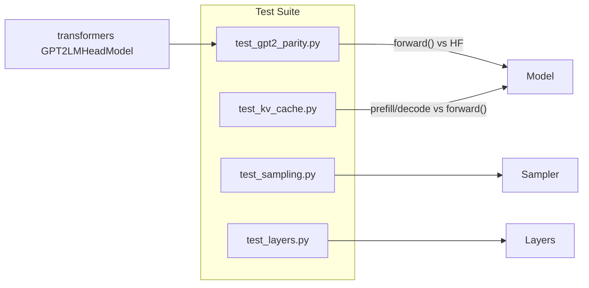

# FlashInfer Architecture

FlashInfer is a minimal GPT-2 inference engine built from scratch in PyTorch. It loads HuggingFace GPT-2 weights and runs text generation through a custom model implementation with KV-cache incremental decode.

---

## Project Structure



| Module | Role |
|--------|------|
| [`flashinfer/engine/generator.py`](../flashinfer/engine/generator.py) | Orchestrates tokenization, prefill, decode loop, decoding |
| [`flashinfer/model/gpt2.py`](../flashinfer/model/gpt2.py) | Full GPT-2 stack: embeddings → 12 blocks → LM head |
| [`flashinfer/cache/kv_cache.py`](../flashinfer/cache/kv_cache.py) | Pre-allocated K/V buffers for incremental decode |
| [`flashinfer/layers/`](../flashinfer/layers/) | Reusable building blocks (attention, MLP, norm, embeddings) |
| [`flashinfer/weights/loader.py`](../flashinfer/weights/loader.py) | Maps HuggingFace Conv1D weights → PyTorch Linear |
| [`flashinfer/sampling/sampler.py`](../flashinfer/sampling/sampler.py) | Greedy, temperature, top-k, top-p sampling |

---

## Initialization Flow

Model loading happens once via `InferenceEngine.from_pretrained()`.



Weight mapping example:

```
HF:   transformer.h.0.attn.c_attn.weight  (768 × 2304)
         ↓ transpose
Ours: blocks[0].attn.qkv.weight           (2304 × 768)
```

---

## Generation Execution Flow

This is the main runtime path used by `generate()` and the CLI.



### Phase Breakdown

| Phase | Input | Model call | Output | Cache state |
|-------|-------|------------|--------|-------------|
| **Prefill** | Full prompt `(1, L)` | `forward_prefill()` | Logits for all L positions | K/V stored for positions `0..L-1`, `seq_len = L` |
| **Decode** (×N) | Single token `(1, 1)` | `forward_decode()` | Logits for 1 position | K/V appended, `seq_len += 1` |

Prefill runs once over the prompt. Each decode step processes a single new token using cached K/V tensors — **O(n) per step** vs **O(n²)** when re-forwarding the full sequence.

---

## GPT-2 Model Internal Dataflow



### Single Transformer Block



Tensor shapes for `gpt2` (124M):

| Tensor | Shape |
|--------|-------|
| `input_ids` | `(batch, seq_len)` |
| Hidden states | `(batch, seq_len, 768)` |
| Q, K, V per head | `(batch, 12, seq_len, 64)` |
| MLP intermediate | `(batch, seq_len, 3072)` |
| Logits | `(batch, seq_len, 50257)` |

---

## KV Cache in Attention



Cache layout (12 layers for gpt2):

```
KVCache
├── layers[0].keys   (1, 12, 1024, 64)
├── layers[0].values (1, 12, 1024, 64)
├── layers[1].keys   ...
├── ...
└── seq_len = current number of tokens processed
```

---

## Sampling Pipeline



---

## Dual Forward Paths

The project maintains two model paths:



- **`forward()`** — full-sequence pass, no cache. Used by parity tests against HuggingFace.
- **`forward_prefill()` / `forward_decode()`** — production path with KV cache. Verified to match `forward()` step-by-step.

---

## End-to-End Overview

```
┌─────────────────────────────────────────────────────────────────┐
│                        USER / CLI                               │
│   "The capital of France is"  →  examples/generate.py           │
└────────────────────────────┬────────────────────────────────────┘
                             │
                             ▼
┌─────────────────────────────────────────────────────────────────┐
│                    InferenceEngine                              │
│  1. Tokenize prompt → [464, 3139, 286, 4881, 318]              │
│  2. Create KVCache (12 layers × pre-allocated buffers)          │
│  3. PREFILL: forward_prefill → logits[-1] → sample token        │
│  4. DECODE loop: forward_decode → logits[-1] → sample token     │
│  5. Decode token ids → text                                     │
└──────┬──────────────────┬──────────────────┬────────────────────┘
       │                  │                  │
       ▼                  ▼                  ▼
┌─────────────┐   ┌──────────────┐   ┌─────────────────┐
│ GPT2Model   │   │ KVCache      │   │ sample_next_token│
│             │   │              │   │ (greedy/temp/    │
│ Embeddings  │◄─►│ K/V per layer│   │  top-k/top-p)   │
│ 12× Block   │   │ seq_len      │   └─────────────────┘
│ ln_f        │   └──────────────┘
│ lm_head     │
└─────────────┘
       ▲
       │ weights loaded once at startup
┌──────┴──────┐
│ HF gpt2     │
│ checkpoint  │
└─────────────┘
```

---

## Test Architecture



| Test file | What it validates |
|-----------|-------------------|
| `test_gpt2_parity.py` | Custom model logits match HuggingFace reference |
| `test_kv_cache.py` | Cached prefill/decode matches full forward path |
| `test_sampling.py` | top-k, top-p, and greedy sampling behavior |
| `test_layers.py` | Output shapes and causal mask correctness |

---

## Summary

FlashInfer follows a classic **prefill + decode** LLM serving pattern:

1. **Load once** — HuggingFace weights mapped into a custom PyTorch GPT-2
2. **Prefill once** — Process the full prompt, populate KV cache
3. **Decode many times** — One token per step using cached K/V
4. **Sample** — Convert logits → next token (greedy or stochastic)
5. **Repeat** until EOS or `max_new_tokens`

The design separates concerns cleanly: **layers** (math), **model** (architecture), **cache** (performance), **engine** (orchestration), **sampling** (decoding strategy).
